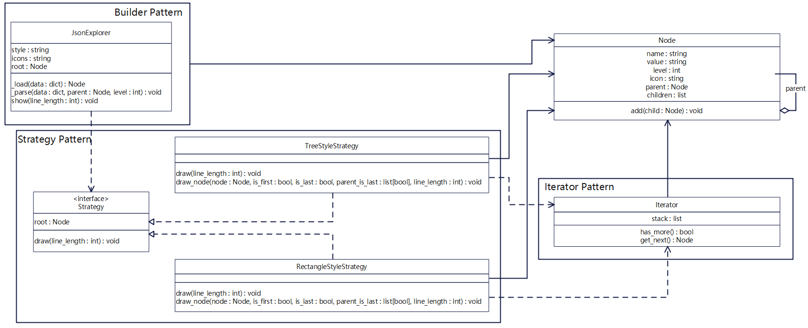
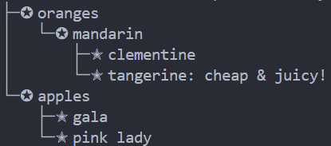
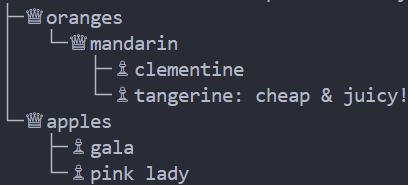
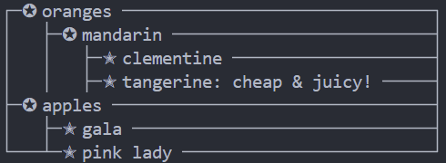
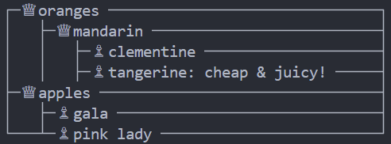

# Funny-JSON-Explorer 2.0
Funny JSON Explorer(FJE)，是一个JSON文件可视化的命令行界面小工具。

```
python main.py -f <json file> -s <style> -i <icon family>
```

## 类图


## 设计模式

1. **迭代器模式**（Iterator Pattern）：Iterator类是迭代器，其具有的has_more方法和get_next方法实现了在不暴露集合底层表现形式 的情况下遍历集合中所有的元素。

2. **策略模式**（Strategy Pattern）：Strategy是策略接口，是所有具体策略的通用接口，TreeStyleStrategy和RectangleStyleStrategy是具体策略，实现了不同风格的draw方法，它们一起实现了策略模式。


## 可扩展性

1.添加新的风格：
在Strategy.py文件中添加新的风格的具体策略类及其相应风格的draw函数即可完成添加新的风格。

2.添加新的图标族：
先在config.py文件中添加新的图标族，然后在IconFamily.py中添加相应的索引即可完成添加新的图标族。

## 运行截图

tree+star:<br />

<br />
tree+king:<br />

<br />
rectangle+star:<br />

<br />
rectangle+king:<br />

